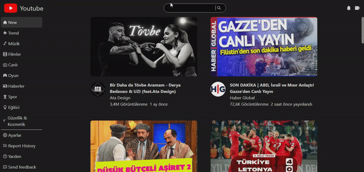

<h1>React Youtube Clone Projesi</h1>

- API Kullanılarak Youtube Verileri alındı
- Context Yapısı Kullanıldı
- Sayfalama Yapısı Oluşturuldu
- Components Yapısı Oluştuldu
- Responsive Yapıya Sahiptir

# Kütüphaneler
react-icons
react-router-dom
axios
millify
moment
react-player
tailwind (kurulumu sitesinde)
Yapılacaklar

<h2>Ekran Alıntısı</h2>

